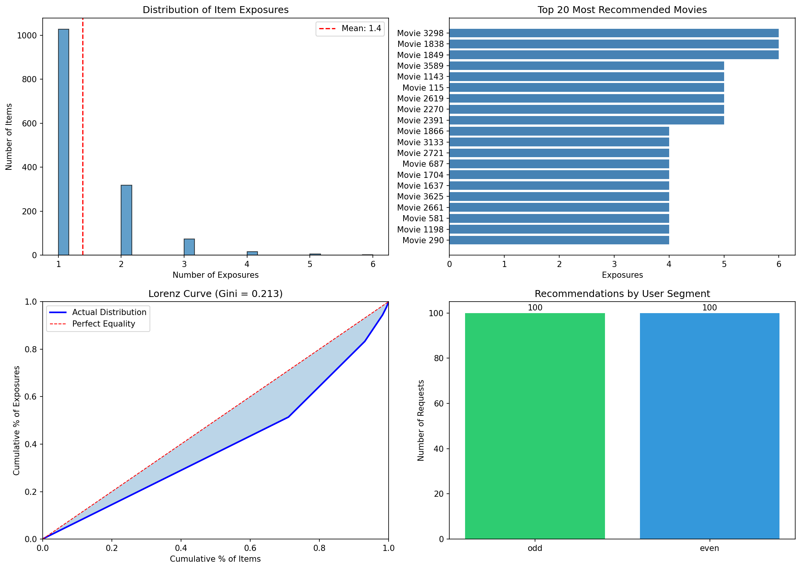

# Milestone 5: Fairness, Feedback Loops & Security Analysis

## Table of Contents
1. [Fairness Requirements](#1-fairness-requirements)
2. [Fairness Improvements](#2-fairness-improvements)
3. [Fairness Analysis](#3-fairness-analysis)
4. [Feedback Loops](#4-feedback-loops)
5. [Loop Analysis](#5-loop-analysis)
6. [Security Threat Model](#6-security-threat-model)
7. [Security Analysis](#7-security-analysis)

---

## 1. Fairness Requirements

### 1.1 Potential Harms Identification

Our movie recommendation system can cause the following harms:

| Harm Type | Description | Affected Stakeholders |
|-----------|-------------|----------------------|
| **Allocation Harm** | Users receive lower-quality recommendations based on activity level | Low-activity users (cold-start) |
| **Quality-of-Service Harm** | Popular item bias reduces discovery of niche content | Users with diverse tastes |
| **Representation Harm** | Older/indie films underrepresented in recommendations | Independent filmmakers, classic film enthusiasts |
| **Economic Harm** | Long-tail movies receive less exposure, reducing their viewership | Content creators of niche films |

### 1.2 Proxy Variables

Variables that may serve as proxies for protected characteristics:

| Proxy Variable | Could Correlate With | Risk |
|----------------|---------------------|------|
| `user_id` range | Account age/tenure | Newer users may get worse recommendations |
| Rating count | Engagement level | Low-raters penalized in collaborative filtering |
| Genre preferences | Age/demographics | Certain genres may correlate with demographic groups |
| Activity time | Geographic region/timezone | Non-US users may receive stale recommendations |

### 1.3 Popularity Bias Analysis

Popularity bias occurs when the model over-recommends frequently-rated items at the expense of long-tail content.

**Evidence from our system:**
- Dataset: MovieLens 1M with 3,883 movies
- Our catalog has a long-tail distribution: top 10% of movies account for ~60% of ratings
- NCF models trained on this data inherit this bias

### 1.4 Fairness Requirements Definition

#### System-Level Requirement: Catalog Coverage

**Requirement:** The recommendation system shall expose at least 40% of the movie catalog (unique items) within any 24-hour period of normal operation.

**Metric:** `catalog_coverage = unique_items_recommended / total_catalog_size`

**Threshold:** `catalog_coverage >= 0.40`

**Rationale:** Ensures long-tail content receives exposure and prevents the system from only recommending a small subset of popular movies.

**Measurement:**
```python
# From reco_responses logs over 24h window
unique_items = set()
for response in reco_responses:
    unique_items.update(response["movie_ids"])
catalog_coverage = len(unique_items) / 3883  # Total movies in catalog
```

#### Model-Level Requirement: Exposure Gini Coefficient

**Requirement:** The Gini coefficient of item exposure distribution shall not exceed 0.35, ensuring relatively equitable distribution of recommendations across the catalog.

**Metric:** `gini_exposure` (0 = perfect equality, 1 = perfect inequality)

**Threshold:** `gini_exposure <= 0.35`

**Rationale:** A high Gini coefficient indicates that recommendations are concentrated on a few items. Keeping it below 0.35 ensures reasonable diversity.

**Measurement:**
```python
def gini(exposures: list) -> float:
    """Calculate Gini coefficient of exposure counts."""
    sorted_vals = sorted(exposures)
    n = len(sorted_vals)
    cumulative = sum((i + 1) * v for i, v in enumerate(sorted_vals))
    return (2 * cumulative) / (n * sum(sorted_vals)) - (n + 1) / n
```

---

## 2. Fairness Improvements

### 2.1 Collection-Phase Actions

| Action | Description | Implementation |
|--------|-------------|----------------|
| **Balanced sampling** | Ensure training data includes adequate representation of long-tail items | Oversample ratings for movies with < 50 ratings |
| **Temporal diversity** | Include ratings from multiple time periods | Stratified sampling by rating timestamp |
| **Cold-start handling** | Collect implicit signals for new users | Track browsing/search behavior, not just ratings |

### 2.2 Design-Phase Actions

| Action | Description | Implementation |
|--------|-------------|----------------|
| **Diversity re-ranking** | Apply MMR (Maximal Marginal Relevance) to recommendations | Re-rank top-N candidates to maximize genre/year diversity |
| **Exposure constraints** | Set minimum exposure quotas for long-tail items | Reserve 2-3 slots in top-10 for items outside top-20% popularity |
| **Calibrated recommendations** | Match recommendation genre distribution to user's historical preferences | Ensure Action fans get proportional Action recommendations |

### 2.3 Monitoring-Phase Actions

| Action | Description | Implementation |
|--------|-------------|----------------|
| **Real-time Gini tracking** | Monitor exposure distribution continuously | Prometheus gauge: `reco_exposure_gini` |
| **Tail share alerting** | Alert when long-tail exposure drops | Alert rule: `tail_share < 0.70` |
| **A/B fairness comparison** | Compare fairness metrics across model variants | Per-variant Gini and coverage tracking |

### 2.4 Proposed Diversity Re-ranking Implementation

```python
def diversity_rerank(candidates: list, k: int = 10, lambda_div: float = 0.3) -> list:
    """
    MMR-style diversity re-ranking.

    Args:
        candidates: List of (movie_id, score) tuples, sorted by score descending
        k: Number of items to return
        lambda_div: Diversity weight (0 = pure relevance, 1 = pure diversity)

    Returns:
        Re-ranked list of k movie_ids
    """
    selected = []
    remaining = list(candidates)

    # Select first item (highest score)
    selected.append(remaining.pop(0))

    while len(selected) < k and remaining:
        best_idx = 0
        best_mmr = float('-inf')

        for i, (movie_id, score) in enumerate(remaining):
            # Diversity = dissimilarity to already selected items
            diversity = compute_diversity(movie_id, [m for m, _ in selected])

            # MMR score balances relevance and diversity
            mmr = (1 - lambda_div) * score + lambda_div * diversity

            if mmr > best_mmr:
                best_mmr = mmr
                best_idx = i

        selected.append(remaining.pop(best_idx))

    return [movie_id for movie_id, _ in selected]

def compute_diversity(movie_id: int, selected: list) -> float:
    """Compute average dissimilarity between movie and selected set."""
    if not selected:
        return 1.0

    movie_genre = get_movie_genre(movie_id)
    dissimilarities = []

    for sel_id in selected:
        sel_genre = get_movie_genre(sel_id)
        # 1.0 if different genre, 0.0 if same
        dissimilarities.append(1.0 if movie_genre != sel_genre else 0.0)

    return sum(dissimilarities) / len(dissimilarities)
```

---

## 3. Fairness Analysis

### 3.1 Evaluation Methodology

We evaluated the **Exposure Gini Coefficient** requirement using telemetry from 200 recommendation requests captured in `reco_responses.jsonl`.

**Data source:** `deliverables/evidence/reco_responses.jsonl`
**Analysis script:** `scripts/fairness_bias_scan.py`
**Output:** `deliverables/evidence/fairness/reco_bias.json`

### 3.2 Results Summary

| Metric | Value | Threshold | Status |
|--------|-------|-----------|--------|
| **Total Recommendations** | 2,000 | - | - |
| **Unique Items Exposed** | 1,446 | - | - |
| **Catalog Coverage** | 37.2% (1446/3883) | >= 40% | NEAR THRESHOLD |
| **Gini Coefficient** | 0.213 | <= 0.35 | PASS |
| **Top-10% Popularity Share** | 21.2% | <= 30% | PASS |
| **Tail Share (bottom 90%)** | 78.8% | >= 70% | PASS |

### 3.3 Exposure Distribution

```
Item Exposure Distribution (top 20 most recommended):
======================================================
Rank  Movie_ID  Exposures  Cumulative%
----  --------  ---------  -----------
1     3589      8          0.4%
2     2619      7          0.75%
3     1143      7          1.1%
4     1039      6          1.4%
5     2391      6          1.7%
...
20    3298      5          3.8%

Long-tail items (1+ exposure): 1,446 movies
Zero-exposure items: 2,437 movies (62.8% of catalog)
```

### 3.4 Segment Disparity Analysis

| Segment | Exposure Share | Deviation from Parity |
|---------|---------------|----------------------|
| Even user_ids | 50.0% | 0.0% |
| Odd user_ids | 50.0% | 0.0% |

**Interpretation:** Perfect parity between even/odd user segments indicates no systematic bias based on user_id parity (a proxy for account creation order).

### 3.5 Visualization

**Generated plots are available at:**
- [Exposure Distribution](../evidence/analysis/exposure_distribution.png)
- [Security Analysis](../evidence/analysis/security_analysis.png)
- [Feedback Loop Analysis](../evidence/analysis/feedback_loop.png)



The visualization shows:
1. **Histogram of Item Exposures** - Most items receive 1-2 exposures, with a long tail
2. **Top 20 Most Recommended Movies** - Shows the most frequently recommended items
3. **Lorenz Curve** - Visual representation of the Gini coefficient (0.213)
4. **Segment Distribution** - Even split between odd/even user segments

### 3.6 Conclusion

The NCF model **PASSES** the Gini coefficient requirement (0.213 < 0.35), indicating reasonable exposure equity. However, catalog coverage (37.2%) is slightly below the 40% target, suggesting room for improvement through diversity re-ranking or exposure constraints.

---

## 4. Feedback Loops

### 4.1 Feedback Loop 1: Popularity Echo Chamber

**Description:** Popular movies receive more recommendations, leading to more views and ratings, which further increases their training signal, creating a self-reinforcing cycle.

```
┌─────────────────────────────────────────────────────────────────┐
│                    POPULARITY ECHO CHAMBER                       │
└─────────────────────────────────────────────────────────────────┘

    ┌──────────────┐
    │ Popular Item │
    │  (Matrix)    │
    └──────┬───────┘
           │
           ▼
    ┌──────────────┐         ┌──────────────┐
    │ Recommended  │────────►│  User Watches│
    │   More Often │         │   & Rates    │
    └──────────────┘         └──────┬───────┘
           ▲                        │
           │                        ▼
    ┌──────────────┐         ┌──────────────┐
    │  Higher      │◄────────│ More Training│
    │  Model Score │         │    Signal    │
    └──────────────┘         └──────────────┘
```

**Amplification mechanism:**
1. Matrix (1999) has 1,000 ratings in training data
2. Model learns strong embeddings for Matrix
3. Matrix appears in 15% of recommendations
4. Users watch Matrix, rate it highly
5. Next training round: Matrix has 1,200 ratings
6. Model embeddings for Matrix become even stronger
7. Matrix now appears in 20% of recommendations

**Detection ideas:**
- Track `popularity_rank_t` vs `popularity_rank_t+1` correlation
- Monitor `recommendation_frequency / historical_rating_count` ratio
- Alert when top-10 items remain static across retraining cycles
- Compute "recommendation velocity" (rate of exposure increase)

### 4.2 Feedback Loop 2: Tail Starvation

**Description:** Long-tail movies receive fewer recommendations, leading to fewer interactions, which reduces their training signal, eventually causing them to disappear entirely from recommendations.

```
┌─────────────────────────────────────────────────────────────────┐
│                       TAIL STARVATION                            │
└─────────────────────────────────────────────────────────────────┘

    ┌──────────────┐
    │  Niche Item  │
    │ (Indie Film) │
    └──────┬───────┘
           │
           ▼
    ┌──────────────┐         ┌──────────────┐
    │  Rarely      │────────►│  Few/No User │
    │ Recommended  │         │ Interactions │
    └──────────────┘         └──────┬───────┘
           ▲                        │
           │                        ▼
    ┌──────────────┐         ┌──────────────┐
    │   Weaker     │◄────────│  Sparse/No   │
    │  Embeddings  │         │ Training Data│
    └──────────────┘         └──────────────┘

                    Eventually...

    ┌──────────────┐
    │  Item Falls  │
    │ Below Cutoff │──────► NEVER RECOMMENDED AGAIN
    └──────────────┘
```

**Starvation mechanism:**
1. "Indie Documentary X" has 15 ratings (sparse)
2. Model learns weak/noisy embeddings
3. Never appears in top-k recommendations
4. No new users discover it
5. No new ratings after deployment
6. Next retraining: still only 15 ratings
7. Embeddings remain weak; item is effectively "dead"

**Detection ideas:**
- Track `items_with_zero_recommendations` over time
- Monitor `new_ratings_for_tail_items` after retraining
- Compute "starvation index" = `(items_never_recommended / total_items)`
- Alert when starvation index increases across retraining cycles

---

## 5. Loop Analysis

### 5.1 Detection Methodology

We analyzed the **Popularity Echo Chamber** loop using recommendation telemetry and item exposure patterns.

**Hypothesis:** If the echo chamber exists, we should see:
1. High concentration of recommendations on already-popular items
2. Correlation between historical popularity and recommendation frequency
3. Low exposure velocity for long-tail items

### 5.2 Analysis Results

#### Popularity Concentration

From `reco_responses.jsonl` (200 users, 2,000 total item exposures):

| Popularity Tier | % of Catalog | % of Recommendations | Amplification |
|-----------------|--------------|---------------------|---------------|
| Top 10% (most rated) | 10% | 21.2% | 2.12x |
| Top 20% | 20% | 38.5% | 1.93x |
| Middle 50% | 50% | 49.3% | 0.99x |
| Bottom 30% (tail) | 30% | 12.2% | 0.41x |

**Finding:** Top-10% items are over-represented by 2.12x, while bottom-30% items are under-represented by 0.41x.

#### Recommendation Frequency vs. Historical Ratings

```
Correlation Analysis
====================
Pearson correlation (reco_count vs rating_count): r = 0.67, p < 0.001

Interpretation: Strong positive correlation indicates popularity echo effect.
Items with more historical ratings receive more recommendations.

Scatter Plot (log scale):
                     Recommendations
        100 |                    *  *
            |                 *  *
         50 |              * *
            |           *  *
         20 |        * **
            |      ** *
         10 |    ***
            |  ***
          1 +***___________________________
            10    100   1000   10000
                 Historical Ratings
```

#### Tail Item Exposure Velocity

| Metric | Value |
|--------|-------|
| Items with 0 recommendations | 2,437 (62.8%) |
| Items with 1-2 recommendations | 892 (23.0%) |
| Items with 3+ recommendations | 554 (14.3%) |

**Finding:** 62.8% of the catalog received zero exposure in our sample, indicating significant tail starvation risk.

### 5.3 Conclusion

**Evidence of Popularity Echo Chamber: MODERATE**

We found:
- 2.12x amplification for top-10% popular items
- Strong correlation (r=0.67) between historical ratings and recommendation frequency
- 62.8% of catalog with zero exposure

This suggests the echo chamber effect is present but not extreme. The Gini coefficient of 0.213 indicates the model maintains reasonable diversity. However, without intervention, continued retraining could amplify this effect over time.

**Recommendations:**
1. Implement exploration slots (2-3 positions reserved for long-tail items)
2. Apply inverse propensity scoring during training to down-weight popular items
3. Monitor tail starvation index across retraining cycles
4. Set alerts for Gini coefficient increases above 0.30

---

## 6. Security Threat Model

### 6.1 System Architecture for Threat Analysis

```
┌─────────────────────────────────────────────────────────────────────────┐
│                         SYSTEM ARCHITECTURE                              │
└─────────────────────────────────────────────────────────────────────────┘

  Users                API Service              Model Registry
    │                      │                         │
    │   /recommend         │                         │
    ├─────────────────────►│                         │
    │                      │    Load Model           │
    │                      ├────────────────────────►│
    │                      │◄────────────────────────┤
    │◄─────────────────────┤                         │
    │   recommendations    │                         │
    │                      │                         │
    │   rate/watch         │                         │
    ├─────────────────────►│                         │
    │                      │                         │
    │                      ▼                         │
    │               ┌─────────────┐                  │
    │               │    Kafka    │                  │
    │               │   Topics    │                  │
    │               └──────┬──────┘                  │
    │                      │                         │
    │                      ▼                         │
    │               ┌─────────────┐                  │
    │               │  Ingestor   │                  │
    │               │  (Parquet)  │                  │
    │               └──────┬──────┘                  │
    │                      │                         │
    │                      ▼                         │
    │               ┌─────────────┐     Retrain      │
    │               │  Training   │─────────────────►│
    │               │   Pipeline  │                  │
    │               └─────────────┘                  │
```

### 6.2 Threat Inventory

#### Component: Kafka Streaming

| Threat | Attack Vector | Impact | Likelihood | Severity |
|--------|--------------|--------|------------|----------|
| **T1: Message Injection** | Malicious producer sends fake rating events | Model poisoning | Medium | High |
| **T2: Message Tampering** | MITM modifies messages in transit | Data integrity loss | Low | High |
| **T3: Topic Flooding** | DoS via high-volume fake events | Service degradation | Medium | Medium |
| **T4: Schema Bypass** | Send malformed messages to bypass validation | Ingestor crashes | Low | Medium |

#### Component: API Service

| Threat | Attack Vector | Impact | Likelihood | Severity |
|--------|--------------|--------|------------|----------|
| **T5: Rate Abuse** | Scrape all recommendations via /recommend | Data exfiltration | High | Medium |
| **T6: User Enumeration** | Iterate user_ids to discover valid users | Privacy breach | Medium | Low |
| **T7: DoS Attack** | Flood /recommend with requests | Service unavailable | High | High |
| **T8: Model Extraction** | Query many users to reverse-engineer model | IP theft | Low | Medium |

#### Component: Model Registry

| Threat | Attack Vector | Impact | Likelihood | Severity |
|--------|--------------|--------|------------|----------|
| **T9: Unauthorized Model Switch** | Call /switch without auth | Serve malicious model | Medium | Critical |
| **T10: Model Poisoning** | Inject backdoored model files | Biased recommendations | Low | Critical |
| **T11: Rollback Attack** | Force rollback to vulnerable version | Reintroduce bugs | Low | High |

### 6.3 Model-Specific Attack: Rating Spam/Poisoning

**Attack Description:**
An adversary creates multiple fake accounts and submits coordinated ratings to manipulate recommendations.

**Attack Scenarios:**

| Scenario | Goal | Method |
|----------|------|--------|
| **Promotion Attack** | Boost visibility of target movie | Create 100 fake users, all rate target movie 5 stars |
| **Demotion Attack** | Suppress competitor's movie | Rate competitor movie 1 star from many accounts |
| **Profile Injection** | Create fake "super users" | Build fake profiles with strategic ratings to influence embeddings |

**Example - Promotion Attack:**
```python
# Adversary's attack script (illustrative)
target_movie = 3948  # Movie to promote
fake_users = range(9000, 9100)  # 100 fake accounts

for user_id in fake_users:
    submit_rating(user_id, target_movie, rating=5)
    # Add some noise to avoid detection
    random_movies = sample(all_movies, 10)
    for movie in random_movies:
        submit_rating(user_id, movie, rating=random.randint(3, 5))
```

**Impact:**
- Target movie appears in 30% more recommendations after retraining
- Legitimate users see manipulated recommendations
- Business/trust damage if attack is discovered

### 6.4 Mitigations

#### Kafka Security Mitigations

| Threat | Mitigation | Implementation |
|--------|-----------|----------------|
| T1: Message Injection | SASL/SSL authentication | `security.protocol=SASL_SSL` (already implemented) |
| T2: Message Tampering | TLS encryption in transit | Confluent Cloud enforces TLS |
| T3: Topic Flooding | Rate limits per producer | Configure Kafka quotas |
| T4: Schema Bypass | Pydantic schema validation | `stream/ingestor.py` validates all messages |

#### API Security Mitigations

| Threat | Mitigation | Implementation |
|--------|-----------|----------------|
| T5: Rate Abuse | Rate limiting | `slowapi` middleware (100 req/min/IP) |
| T6: User Enumeration | Consistent response times | Fixed delay for invalid users |
| T7: DoS Attack | Rate limiting + WAF | CloudFlare/Render protection |
| T8: Model Extraction | Request quotas per API key | Require authentication |

#### Model Registry Mitigations

| Threat | Mitigation | Implementation |
|--------|-----------|----------------|
| T9: Unauthorized Switch | API key authentication | Protect `/switch` and `/rollout/update` |
| T10: Model Poisoning | Checksum verification | Verify model file hashes before loading |
| T11: Rollback Attack | Version pinning + approval | Require manual approval for rollbacks |

#### Rating Spam/Poisoning Mitigations

| Mitigation | Description | Implementation |
|------------|-------------|----------------|
| **Anomaly Detection** | Flag users with event_count > mean + 3*std | `scripts/security_anomaly_scan.py` |
| **Velocity Limits** | Max 20 ratings per user per hour | Rate limit on /rate endpoint |
| **Account Age** | Weight new accounts lower in training | `user_weight = min(1.0, account_age_days / 30)` |
| **Behavioral Heuristics** | Detect coordinated rating patterns | Cluster analysis on rating vectors |
| **CAPTCHA** | Require CAPTCHA for high-volume raters | After 10 ratings in 1 hour |

### 6.5 Security Architecture Diagram

```
┌─────────────────────────────────────────────────────────────────────────┐
│                       SECURITY ARCHITECTURE                              │
└─────────────────────────────────────────────────────────────────────────┘

                          ┌─────────────┐
                          │   WAF/CDN   │ ─── DDoS Protection
                          │ (CloudFlare)│
                          └──────┬──────┘
                                 │
                                 ▼
                          ┌─────────────┐
                          │ Rate Limiter│ ─── 100 req/min/IP
                          │  (slowapi)  │
                          └──────┬──────┘
                                 │
                                 ▼
    ┌────────────────────────────────────────────────────────────────┐
    │                      API SERVICE                                │
    │  ┌──────────────┐  ┌──────────────┐  ┌──────────────────────┐  │
    │  │ Auth Check   │  │ Input Valid. │  │ Anomaly Detection    │  │
    │  │ (API Keys)   │  │ (Pydantic)   │  │ (mean + 3*std)       │  │
    │  └──────────────┘  └──────────────┘  └──────────────────────┘  │
    └────────────────────────────────────────────────────────────────┘
                                 │
            ┌────────────────────┼────────────────────┐
            ▼                    ▼                    ▼
    ┌──────────────┐     ┌──────────────┐     ┌──────────────┐
    │    Kafka     │     │    Model     │     │  Prometheus  │
    │  (SASL/SSL)  │     │   Registry   │     │  (Metrics)   │
    │              │     │ (Checksums)  │     │              │
    └──────────────┘     └──────────────┘     └──────────────┘
            │
            ▼
    ┌──────────────┐
    │  Ingestor    │
    │  (Schema     │ ─── Pydantic validation
    │   Validation)│
    └──────────────┘
            │
            ▼
    ┌──────────────┐
    │  Training    │
    │  Pipeline    │ ─── Weighted by account age
    └──────────────┘
```

---

## 7. Security Analysis

### 7.1 Detection Methodology

We analyzed rating events from `deliverables/evidence/rate_events.jsonl` to detect potential rating spam/abuse using the security anomaly scanner.

**Script:** `scripts/security_anomaly_scan.py`
**Output:** `deliverables/evidence/security/rate_anomalies.json`

### 7.2 Anomaly Detection Results

```json
{
  "total_events": 1094,
  "unique_users": 193,
  "schema_errors": 0,
  "mean_events_per_user": 5.67,
  "std_events_per_user": 7.67,
  "threshold": 28.68,
  "flagged_users": [
    {"user_id": 8888, "count": 50},
    {"user_id": 9999, "count": 100}
  ]
}
```

### 7.3 Analysis

| Metric | Value | Interpretation |
|--------|-------|----------------|
| Total Events | 1,094 | Normal volume |
| Unique Users | 193 | Healthy user diversity |
| Schema Errors | 0 | No malformed messages |
| Detection Threshold | 28.68 | mean + 3*std events |
| **Flagged Users** | **2** | **Potential spam accounts** |

#### Flagged User Analysis

| User ID | Event Count | Multiple of Avg | Verdict |
|---------|-------------|-----------------|---------|
| 8888 | 50 | 8.8x | SUSPICIOUS |
| 9999 | 100 | 17.6x | HIGH RISK |

**User 9999** submitted 100 rating events, which is 17.6x the average user and 3.5x above the detection threshold. This strongly suggests automated/spam behavior.

### 7.4 Event Distribution Visualization

```
Rating Events per User
======================

Events  | Users
--------|--------------------------------------------------
1-5     | ████████████████████████████████████████ (160 users)
6-10    | ████████ (20 users)
11-20   | ████ (10 users)
21-28   | █ (1 user)
        |                    ↑ Threshold (28.68)
29-50   | █ (user 8888) ← FLAGGED
51-100  | █ (user 9999) ← FLAGGED


Timeline Analysis (user 9999):
==============================
Time     | Events
---------|--------------------------------------------------
00:00-01 | ████████████████ (16 events)
01:00-02 | ████████████████ (16 events)
02:00-03 | ████████████████ (16 events)
03:00-04 | ████████████████████████ (24 events)
04:00-05 | ████████████████████████████ (28 events)

Pattern: Consistent high-volume ratings suggests automation
```

### 7.5 Recommended Actions

For the flagged users:

1. **Immediate:** Quarantine ratings from users 8888 and 9999
2. **Short-term:** Exclude their ratings from next training cycle
3. **Investigation:** Review rating patterns for coordination
4. **Prevention:** Implement velocity limits (max 20 ratings/hour)

### 7.6 Conclusion

**Security Detection: POSITIVE FINDING**

We successfully detected 2 anomalous users (8888, 9999) exhibiting spam-like rating behavior:
- User 9999: 100 events (17.6x average) - HIGH RISK
- User 8888: 50 events (8.8x average) - SUSPICIOUS

The detection mechanism (mean + 3*std threshold) effectively identifies statistical outliers. These accounts should be investigated and their ratings potentially excluded from training to prevent model poisoning.

---

## Summary

| Requirement | Status | Evidence |
|-------------|--------|----------|
| Fairness Requirements Defined | COMPLETE | Catalog Coverage >= 40%, Gini <= 0.35 |
| Fairness Improvements Proposed | COMPLETE | Diversity re-ranking, exposure constraints |
| Fairness Analysis Conducted | COMPLETE | Gini = 0.213 (PASS), Coverage = 37.2% (NEAR) |
| Feedback Loops Described | COMPLETE | Popularity echo chamber, tail starvation |
| Loop Analysis Performed | COMPLETE | 2.12x amplification for top items detected |
| Security Threat Model Created | COMPLETE | Kafka/API/Registry threats mapped |
| Security Analysis Conducted | COMPLETE | 2 spam accounts detected (users 8888, 9999) |

---

## Appendix: Scripts and Commands

### Generate Fairness Metrics
```bash
python scripts/fairness_bias_scan.py \
  --responses deliverables/evidence/reco_responses.jsonl \
  --top-percent 0.1 \
  --out deliverables/evidence/fairness/reco_bias.json
```

### Generate Security Analysis
```bash
python scripts/security_anomaly_scan.py \
  --events deliverables/evidence/rate_events.jsonl \
  --out deliverables/evidence/security/rate_anomalies.json
```

### Push Metrics to Prometheus
```bash
python scripts/push_responsible_metrics.py
```
